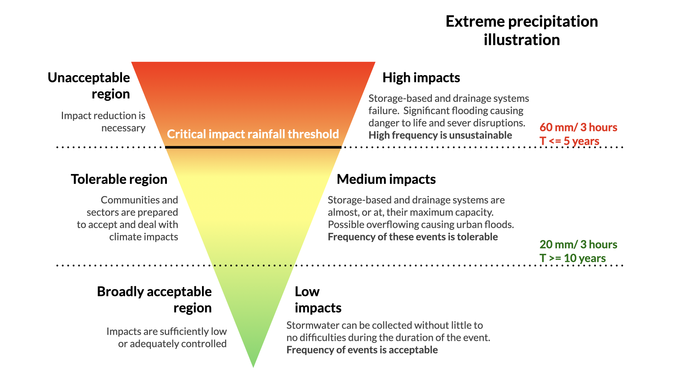
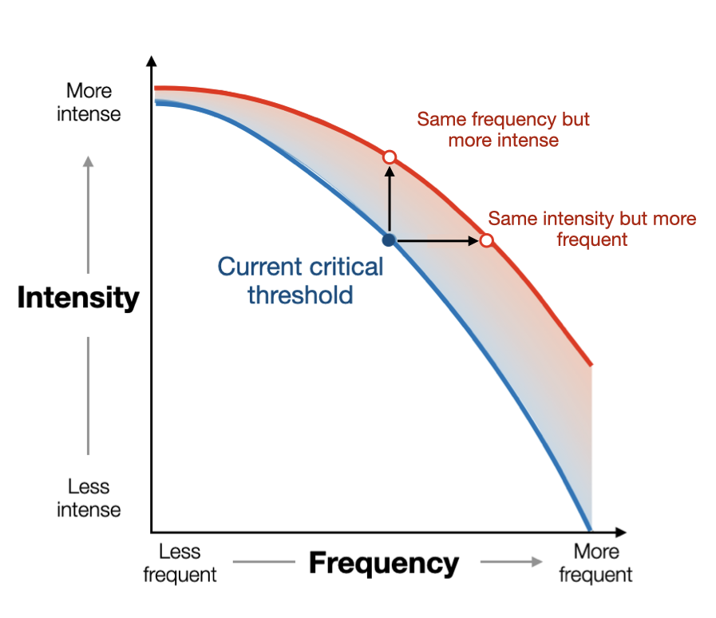

# Extreme Precipitation: Interpretation of extreme rainfall climate data for risk assessment.
As explained in the introduction section, the frequency and intensity of extreme precipitation events are likely to change under climate change scenarios. These projected changes can translate to an increase in the frequency and magnitude of pluvial floods [urban and flash floods] as these result from the precipitation intensity **exceeding the critical impact rainfall thresholds** of natural and artificial drainage systems capacities.

## What are critical impact rainfall thresholds?
**Impact rainfall thresholds** are defined as the precipitation required within a specific timeframe to trigger various impacts such as urban flooding in vulnerable areas or sites (e.g., low-lying). Additionally, these are commonly used in the design of civil works like road drainage systems, flood protection infrastructure and serve as decision support values for early warning systems (Meléndez-Landaverde & Sempere-Torres, 2022). Hence, impact rainfall thresholds serve as key indicators, helping link local potential risk and their consequences to specific rainfall intensity values.

In this context, a **critical impact rainfall threshold** is defined as the precipitation necessary to trigger unsustainable or unacceptable impacts. This concept is closely related to the “**risk-tolerance level**”, defined as the maximum amount of loss, impacts or frequency that areas, communities and regions are prepared to handle due to climate hazards, or in this case, extreme precipitation. Consequently, these naturally vary across communities and sectors (e.g., transportation or agriculture) as risk is not absolute, but a social construct that depends on the local context, the coping capacity and risk perception.

By clearly defining impact and critical rainfall thresholds based on their tolerance levels, communities and sectors can proactively develop metrics for climate risk assessment, design appropriate adaptation measures and enhance their overall resilience.

## Changes in local critical impact rainfall thresholds under climate change: Magnitude and frequency.

The rainfall data computed by the above code can help local areas, communities and regions understand how their specific impact and critical rainfall thresholds metrics can vary under the influence of climate change scenarios based on the expected changes in carbon emissions.
 
For example, the extreme rainfall climate data computed in this workflow con provide some insight on how current critical rainfall thresholds for local physical measures, such as urban rainfall retention basins, reservoirs, low points and urban drainage systems will be exceeded (or not) in terms of Magnitude (e.g., intensity) and frequency (e.g., return periods) due to climate change.

By understanding how these key thresholds will fluctuate at a local level, communities can make informed decisiones about the most appropriate long-term adaptation measures to decrease the potential negative consequences. These can include increasing the capacity of water collection systems, updating their early warning systems or developing awareness campaigns on more frequent extreme precipitation events. The result is a more comprehensive and encompassing
local risk assessment ans strategies for adapting to the challenges posed by climate change.
 
We encourage you to adapt the code for your local area and explore how specific critical impact rainfall thresholds will evolve under climate change scenarios. To facilitate the analysis and identify your critical areas or points of interest, we recommend overlaying your relevant local vulnerability (e.g., age groups, land use) and exposure (e.g, population, critical infrastructure) datasets with the calculated rainfall.

## Authors
The Center of Applied Research in Hydrometrology from the Universitat Politècnica de Catalunya (CRAHI-UPC). The members involved in the development of this workflow were the following (Alphabetic order):
 
Marta Gabarró Solanas 
Víctor González 
Erika R. Meléndez-Landaverde 
Daniel Sempere-Torres 

## References
Meléndez-Landaverde, E., Sempere-Torres, D. (2022) Design and evaluation of community and impact-based flood warnings: The SS-EWS framework. _Journal of Flood Risk Management_, e12860. https://doi.org/10.1111/jfr3.12860
